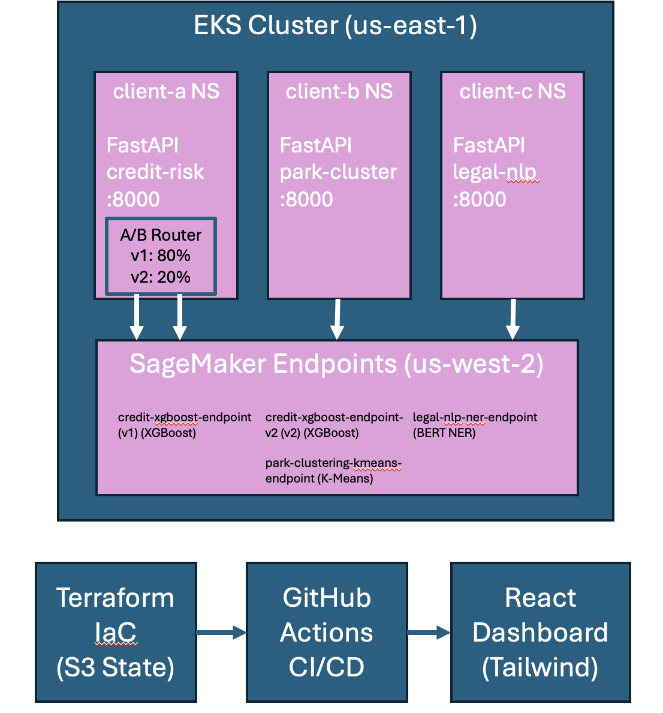

# ML Platform Delivery — Multi-Client SageMaker + Kubernetes

Internal platform that orchestrates ML endpoints for three client contracts using SageMaker, FastAPI, Kubernetes (EKS), Terraform, GitHub Actions CI/CD, and a React dashboard.

## Architecture



## Client Contracts

| Client | Use Case | Model | Endpoint |
|--------|----------|-------|----------|
| **A** — Financial Services | Credit risk scoring | XGBoost (binary classification) | `credit-xgboost-endpoint` |
| **B** — Outdoor Recreation | Park accessibility ranking | K-Means (clustering, k=5) | `park-clustering-kmeans-endpoint` |
| **C** — Legal Tech | Contract entity extraction | HuggingFace BERT NER | `legal-nlp-ner-endpoint` |

## Project Structure

```
assessment-iv/
├── sagemaker/
│   ├── client-a-credit-risk/       # XGBoost pipeline (01-04)
│   ├── client-b-park-clustering/   # K-Means pipeline (01-04)
│   └── client-c-contract-nlp/      # HuggingFace deploy (01)
├── services/
│   ├── client-a/                   # FastAPI + Dockerfile
│   ├── client-b/
│   └── client-c/
├── k8s/
│   ├── client-a/                   # namespace, configmap, deployment, service, quota, limits
│   ├── client-b/
│   └── client-c/
├── terraform/                      # provider, variables, main, outputs
├── dashboard/                      # React + Vite + Tailwind
├── .github/workflows/cicd.yml      # Build → Push → Deploy → Verify
└── README.md
```

## Setup

### Prerequisites
- AWS CLI configured with `class` profile
- kubectl configured for EKS cluster
- Terraform >= 1.0
- Node.js >= 18 (for dashboard)
- Python 3.11+ (for SageMaker scripts and local FastAPI)
- Docker (for building images)

### 1. SageMaker Endpoints

Each client's pipeline runs sequentially:

```bash
# Activate Python environment
python -m venv venv && source venv/bin/activate
pip install -r requirements.txt

# Client A — Credit Risk (XGBoost)
python sagemaker/client-a-credit-risk/01_explore_data.py
python sagemaker/client-a-credit-risk/02_prepare_data.py
python sagemaker/client-a-credit-risk/03_train_model.py
python sagemaker/client-a-credit-risk/04_deploy_endpoint.py

# Client B — Park Clustering (K-Means)
python sagemaker/client-b-park-clustering/01_explore_data.py
python sagemaker/client-b-park-clustering/02_prepare_data.py
python sagemaker/client-b-park-clustering/03_train_model.py
python sagemaker/client-b-park-clustering/04_deploy_endpoint.py

# Client C — Legal NLP (HuggingFace, no training needed)
python sagemaker/client-c-contract-nlp/01_deploy_endpoint.py
```

### 2. Terraform Infrastructure

```bash
cd terraform
terraform init          # Downloads providers, connects to S3 backend
terraform plan          # Preview changes
terraform apply         # Creates namespaces, configmaps, quotas on EKS
terraform destroy       # Tear down (when done)
```

Remote state stored in `s3://ai-ops-tf-remote-state-0/kathleenh/assessment-iv/` with DynamoDB locking.

### 3. Kubernetes Deployment

Secrets must be created manually (not committed to repo):

```bash
kubectl create secret generic client-a-aws-credentials \
  --from-literal=AWS_ACCESS_KEY_ID=<your-key> \
  --from-literal=AWS_SECRET_ACCESS_KEY=<your-secret> \
  -n client-a

# Repeat for client-b and client-c namespaces
```

Apply manifests (or let CI/CD handle it):

```bash
kubectl apply -f k8s/client-a/
kubectl apply -f k8s/client-b/
kubectl apply -f k8s/client-c/
```

### 4. CI/CD Pipeline

The GitHub Actions workflow (`.github/workflows/cicd.yml`) triggers on push to `main`:

1. **Build** — Builds 3 Docker images, pushes to GHCR (`ghcr.io/kd365/`)
2. **Deploy** — Updates kubeconfig, applies K8s manifests to EKS
3. **Verify** — Checks rollout status for all 3 deployments

Required GitHub Secrets:
- `AWS_ACCESS_KEY_ID`
- `AWS_SECRET_ACCESS_KEY`

### 5. Dashboard

```bash
cd dashboard
npm install
npm run dev     # http://localhost:3000
```

Features: live health polling (15s), service status badges, team ownership display, test-request interface.

To point at deployed services, set environment variables:
```bash
VITE_CLIENT_A_URL=http://<loadbalancer-a> \
VITE_CLIENT_B_URL=http://<loadbalancer-b> \
VITE_CLIENT_C_URL=http://<loadbalancer-c> \
npm run dev
```

### 6. Local Development (FastAPI services)

```bash
source venv/bin/activate

# Run each service in a separate terminal
cd services/client-a && uvicorn app:app --port 8001
cd services/client-b && uvicorn app:app --port 8002
cd services/client-c && uvicorn app:app --port 8003
```

## API Endpoints

All three services expose:

| Endpoint | Method | Description |
|----------|--------|-------------|
| `/health` | GET | Liveness probe — is the process alive? |
| `/ready` | GET | Readiness probe — can it serve traffic? |
| `/predict` | POST | Model inference |

### Predict Request Examples

**Client A** (Credit Risk):
```json
POST /predict
{"features": [0.5, 0.3, 1.0, ...]}  // 43 numeric features
// Returns: {"prediction": 0.73, "confidence": "high"}
```

**Client B** (Park Clustering):
```json
POST /predict
{"features": [0.5, 0.5, 1, 1, 0, 1, 0, 1, 0, 0, 0.4, 0.6]}  // 12 features
// Returns: {"cluster": 3, "distance": 1.77}
```

**Client C** (Legal NLP):
```json
POST /predict
{"text": "Acme Corp shall pay $50,000 to John Smith by December 31, 2025."}
// Returns: {"entities": [{"word": "Acme Corp", "entity": "B-ORG", "score": 0.99}, ...], "text": "..."}
```

## Design Decisions

- **Serverless SageMaker endpoints** — Pay-per-invocation, no idle costs. Cold starts handled by retry logic in FastAPI.
- **Namespace separation** — Each client in its own K8s namespace with ResourceQuota and LimitRange for isolation.
- **Terraform for K8s resources** — Namespaces, ConfigMaps, and quotas managed as code via Kubernetes provider, not just YAML.
- **HuggingFace for Client C** — Pre-trained NER model deployed directly to SageMaker, no training pipeline needed.
- **EKS in us-east-1, SageMaker in us-west-2** — Cross-region by design; ConfigMaps pass the correct SageMaker region to pods.
